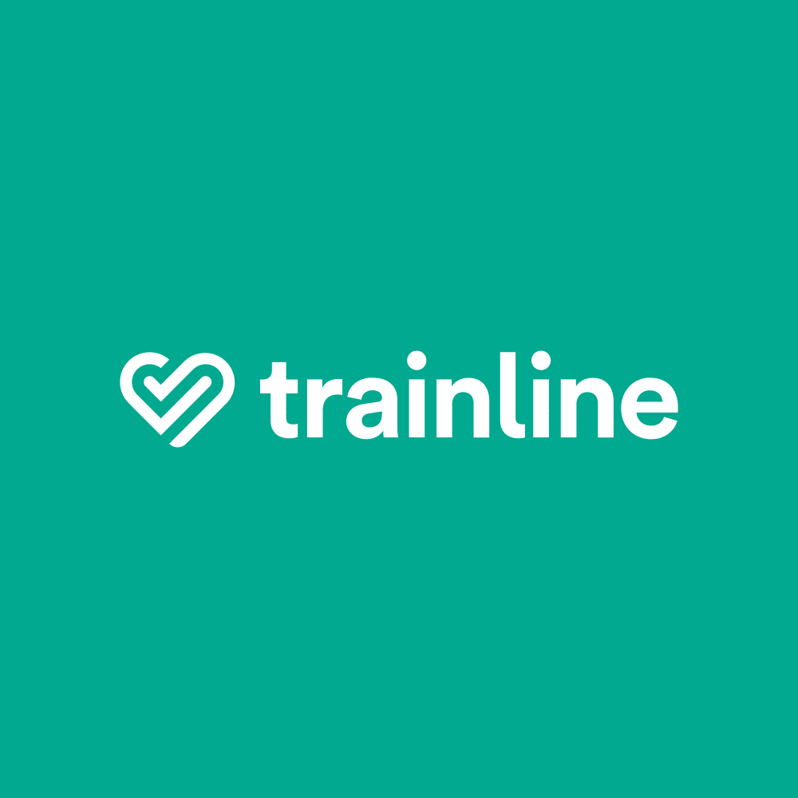

# 𝖳𝖺𝗂𝗅𝗈𝗋𝖾𝖽-𝗅𝗂𝗇𝖾 𝖠𝖨 𝖥𝖾𝖺𝗍𝗎𝗋𝖾 𝖡𝗒 𝖠𝖺𝗅𝗂𝗒𝖺𝗇𝖺 𝖠𝖽𝗈𝗅𝖾𝗒 𝖬𝗂𝗇𝗀𝗅𝖾 - 𝖳𝗋𝖺𝗂𝗇𝗅𝗂𝗇𝖾 

𝖳𝗈𝖽𝖺𝗒 𝖨 𝗁𝖺𝗏𝖾 𝗍𝗁𝖾 𝗁𝗈𝗇𝗈𝗎𝗋 𝗈𝖿 𝗉𝗋𝖾𝗌𝖾𝗇𝗍𝗂𝗇𝗀 𝗍𝗈 𝗒𝗈𝗎 𝖳𝗋𝖺𝗂𝗇𝗅𝗂𝗇𝖾'𝗌🚆 𝖭𝖾𝗐 𝖠𝖨 𝖥𝖾𝖺𝗍𝗎𝗋𝖾 𝖼𝖺𝗅𝗅𝖾𝖽 '𝖳𝖺𝗂𝗅𝗈𝗋𝖾𝖽𝖫𝗂𝗇𝖾 𝖠𝖨'🤖 , 𝖡𝗒 𝖸𝗈𝗎𝗋𝗌 𝗍𝗋𝗎𝗅𝗒 😊

## Feature Inspiration 💡

Welcome to Tailored-line AI🚆✨- a feature designed to create personalised travel itineraries for Trainline customers. It’s a wonderfully inclusive, data-driven solution that enhances our customers’ travel experiences while using our service!

Tailored-line is a feature I developed, inspired by Trainline's Inspiration travel blog 🌍 and Europe travel itinerary 🗺️.

The idea came to me as I was reading Trainlines website: What if we could take this part of our service to the next level? By adding a personalised touch with new generational, cutting-edge technology, we could create something truly special. I wanted to design this feature in a way that would align with Trainline's core values - delivering data-driven solutions 📊, fostering inclusivity 🌈, and, most importantly, ensuring every customer enjoys their travel experience with simplicity and positivity 😊.

At Trainline, we're dedicated to solving Problems to deliver pragmatical and simple solutions 📈

### So imagine this...  🤔

#### Meet our Trainliner, Ruby 👋

Ruby is travelling to Milan using Trainline’s services, but she hasn’t planned out her journey or itinerary. She decides to explore Trainline’s Inspiration travel blog 🌍 and Europe travel itinerary 🗺️ for some ideas. While these resources provide some great inspiration, Ruby feels she still needs a more structured and tailored plan to guide her trip.

That’s when she discovers Trainline’s newly launched Tailored-line feature 👀✨ a tool designed to create personalised travel itineraries with just one click. Instead of piecing together a plan herself and risking potential mistakes 🚧; especially in an unfamiliar city 🏙️, Ruby now has a seamless, all-in-one itinerary created just for her. In moments, her travel worries are replaced with excitement 🎉, and she’s ready to enjoy her trip with clarity and confidence 😊.

Let’s take a closer look at Ruby’s experience with Tailored-line AI and how this personalised approach transforms travel planning into a stress-free and enjoyable process 🚆💼.

##

## Ruby's Tailored Experience 🌐

All Ruby needs to do is enter her Trainline user ID so that Tailored-line can sync her account and previous travel history to understand logical travel preferences like student discount , cheapest fare , first class , and refundable tickets.

Then she can select the "Get Travel Recommendations" button to move on to the next stage. 👉📲

 Ruby is the  greeted by our Tailored-line bot and is encouraged to take a quick travel questionnaire that will take some details about her trip 📝. These details will be used as data to generate her personalised itinerary based on factual information about her travel.🌍

This questionnaire is designed specifically to collect data about Ruby's travel destination (Milan)📍...

Ruby's Dietary Requirements (in this instance, Ruby is vegan) 🥗

The area of Ruby's stay location (hotel) 🏨

And Ruby's activity preferences 🎨🏞️...

Now, this is where the magic ✨ actually begins as Ruby is redirected to a Trainline webpage with her personalised itinerary displayed in sequenced and organised sections! 📄🗺️🚆

The first section will display places that Ruby can visit on her trip to Milan 🏛️🖼️ based on the preferences selected in the questionnaire! 

The second section will display vegan dining options for Ruby 🥗🌱, taking away the hassle of having to search for all of these restaurants beforehand. 🍴✅

The third section will display train stations 🚉 in or near the area of Ruby's hotel 🏨. This is to ensure that Ruby can get around the city with the knowledge of transport facilities, making travelling around Milan much easier. 🚆🗺️

The fourth and last section will display some travel tips 💡 that Ruby may benefit from on her trip. This will include the best ways to save money 💷 and the recommended methods of transport. 🚖💼

This is a concise and clear representation of how Tailored-line AI will be experienced by our users and how implementing a real-life example (Ruby) can really make this feature come to life. ✨

Tailored-line isn’t just an additional feature for trainline services. It’s a system that allows our customers to have a fulfilling, personalised, and safe travel experience, making every trip enjoyable and seamless. 🚆

Ultimately, people may not remember what a service did for them, but how the service made them feel and the lengths gone to create that impact (like it did for Ruby 😊).

### Now, Lets Dive into the technical Components of Tailored-line and how the technologies I used assemble together to create this solution

#

