# 𝖳𝖺𝗂𝗅𝗈𝗋𝖾𝖽-𝗅𝗂𝗇𝖾 𝖠𝖨 𝖥𝖾𝖺𝗍𝗎𝗋𝖾 𝖡𝗒 𝖠𝖺𝗅𝗂𝗒𝖺𝗇𝖺 𝖠𝖽𝗈𝗅𝖾𝗒 𝖬𝗂𝗇𝗀𝗅𝖾 - 𝖳𝗋𝖺𝗂𝗇𝗅𝗂𝗇𝖾 


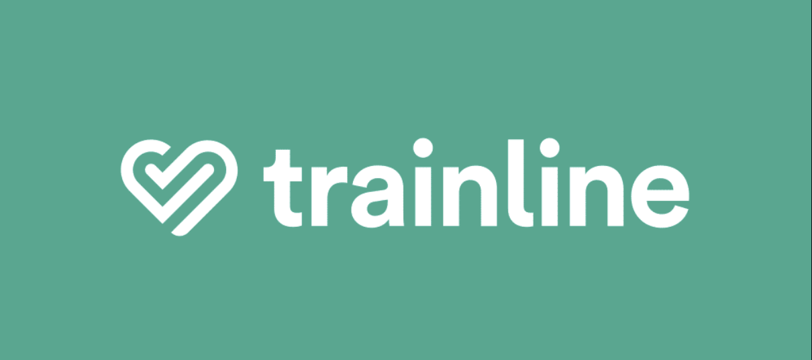

## 𝖳𝗈𝖽𝖺𝗒 𝖨 𝗁𝖺𝗏𝖾 𝗍𝗁𝖾 𝗁𝗈𝗇𝗈𝗎𝗋 𝗈𝖿 𝗉𝗋𝖾𝗌𝖾𝗇𝗍𝗂𝗇𝗀 𝗍𝗈 𝗒𝗈𝗎 𝖳𝗋𝖺𝗂𝗇𝗅𝗂𝗇𝖾'𝗌🚆 𝖭𝖾𝗐 𝖠𝖨 𝖥𝖾𝖺𝗍𝗎𝗋𝖾 𝖼𝖺𝗅𝗅𝖾𝖽 '𝖳𝖺𝗂𝗅𝗈𝗋𝖾𝖽𝖫𝗂𝗇𝖾 𝖠𝖨'🤖 , 𝖡𝗒 𝖸𝗈𝗎𝗋𝗌 𝗍𝗋𝗎𝗅𝗒 😊

## Feature Inspiration 💡

Welcome to Tailored-line AI🚆✨- a feature designed to create personalised travel itineraries for Trainline customers. It’s a wonderfully inclusive, data-driven solution that enhances our customers’ travel experiences while using our service!

Tailored-line is a feature I developed, inspired by Trainline's Inspiration travel blog 🌍 and Europe travel itinerary 🗺️.

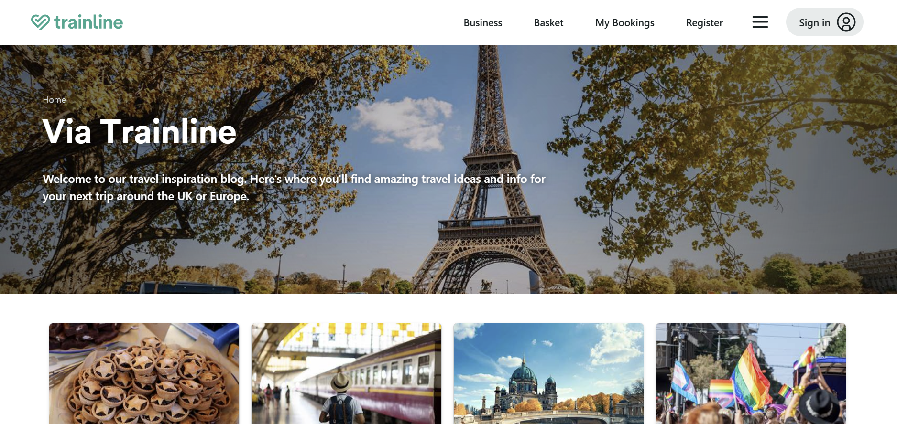

The idea came to me as I was reading Trainlines website: What if we could take this part of our service to the next level? By adding a personalised touch with new generational, cutting-edge technology, we could create something truly special. I wanted to design this feature in a way that would align with Trainline's core values - delivering data-driven solutions 📊, fostering inclusivity 🌈, and, most importantly, ensuring every customer enjoys their travel experience with simplicity and positivity 😊.

#### (Take a look at how Tailored-line as a feature directly aligns with Trainline's moral values! ⬇️)

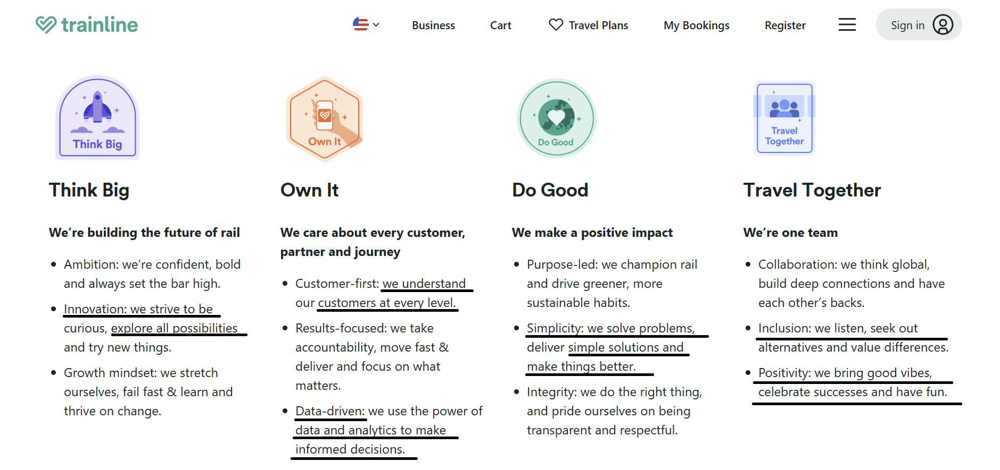

##### While Developing this feature i wanted to think about how i could directly intertwine trainlines moral values as I understand the importance of these aspects when contributing to the company! 🤝

**Innovation:** I was able to think big and explore the possibilities of how new technology would positively impact trainline software 🚀✨

**Data-driven solutions:** customers are the heart of trainline and by having a feature that is specifically dedicated to a personalised approach emphasises how much we care about understanding individuals at every level. 📊❤️

**Simplicity:** By having a feature that reduces travel stress for customers encourages simplicity with trainline services making it accomadatable for everyone. 🧳😊

**Inclusion and Positivity:** Tailored-line is inclusive to all Trainline Customers due to its tailored preferences approach and overall creates a positive impact by showing our Trainliners that we care. 🌍🤗

#

#### At Trainline, we're dedicated to solving Problems to deliver pragmatical and simple solutions 📈

### So imagine this...  🤔

#### Meet our Trainliner, Ruby 👋


Ruby is travelling to Milan using Trainline’s services, but she hasn’t planned out her journey or itinerary. She decides to explore Trainline’s Inspiration travel blog 🌍 and Europe travel itinerary 🗺️ for some ideas. While these resources provide some great inspiration, Ruby feels she still needs a more structured and tailored plan to guide her trip.

That’s when she discovers Trainline’s newly launched Tailored-line feature 👀✨ a tool designed to create personalised travel itineraries with just one click. Instead of piecing together a plan herself and risking potential mistakes 🚧; especially in an unfamiliar city 🏙️, Ruby now has a seamless, all-in-one itinerary created just for her. In moments, her travel worries are replaced with excitement 🎉, and she’s ready to enjoy her trip with clarity and confidence 😊.

Let’s take a closer look at Ruby’s experience with Tailored-line AI and how this personalised approach transforms travel planning into a stress-free and enjoyable process 🚆💼.

##

## Ruby's Tailored Experience 🧭

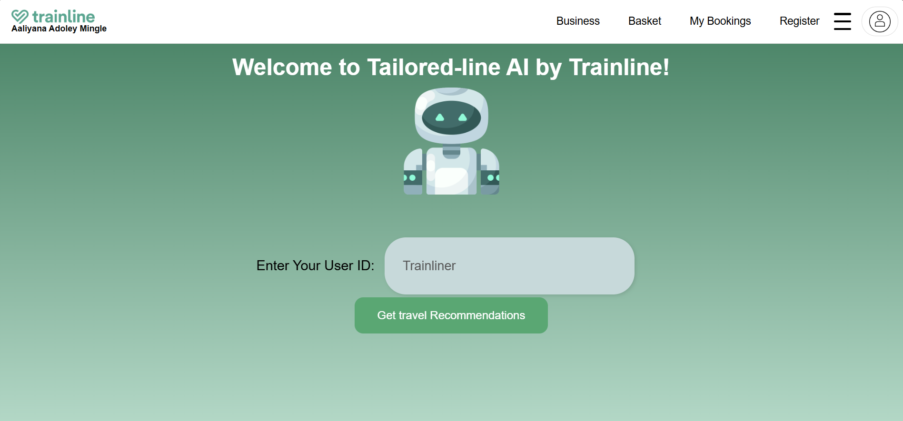

All Ruby needs to do is enter her Trainline user ID so that Tailored-line can sync her account and previous travel history to understand logical travel preferences like student discount , cheapest fare , first class , and refundable tickets.

Then she can select the "Get Travel Recommendations" button to move on to the next stage. 👉📲

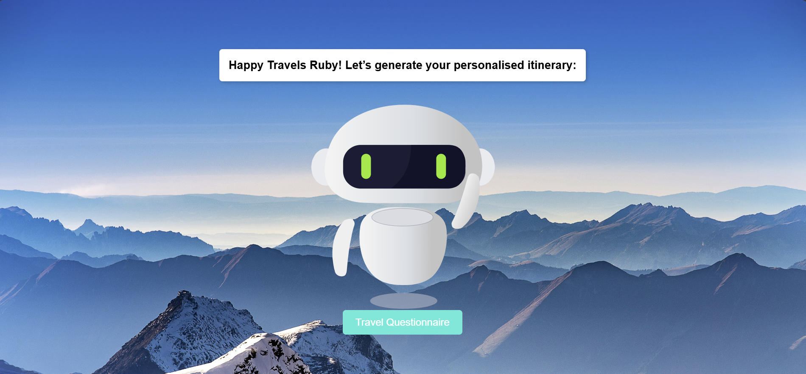

 Ruby is then greeted by our Tailored-line bot and is encouraged to take a quick travel questionnaire that will take some details about her trip 📝. These details will be used as data to generate her personalised itinerary based on factual information about her travel.🌍

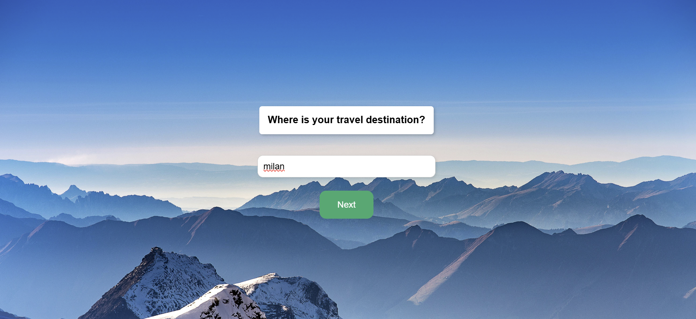

This questionnaire is designed specifically to collect data about Ruby's travel destination (Milan)📍...


Ruby's Dietary Requirements (in this instance, Ruby is vegan) 🥗

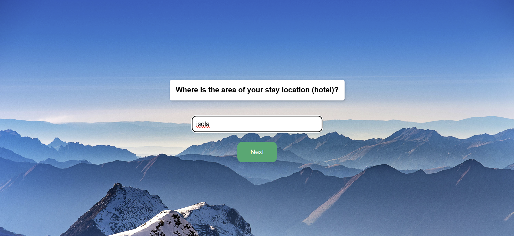

The area of Ruby's stay location (hotel) 🏨


And Ruby's activity preferences 🎨🏞️...

Now, this is where the magic ✨ actually begins as Ruby is redirected to a Trainline webpage with her personalised itinerary displayed in sequenced and organised sections! 📄🗺️🚆

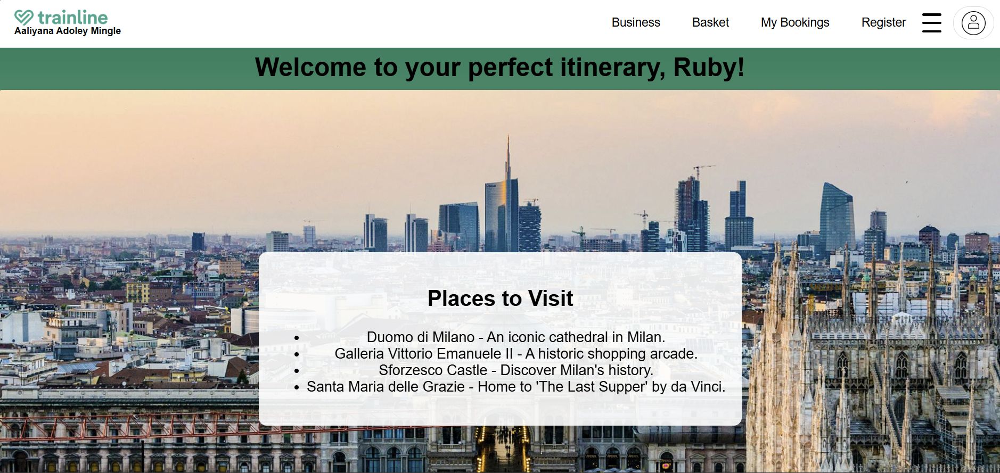

The first section will display places that Ruby can visit on her trip to Milan 🏛️🖼️ based on the preferences selected in the questionnaire! 

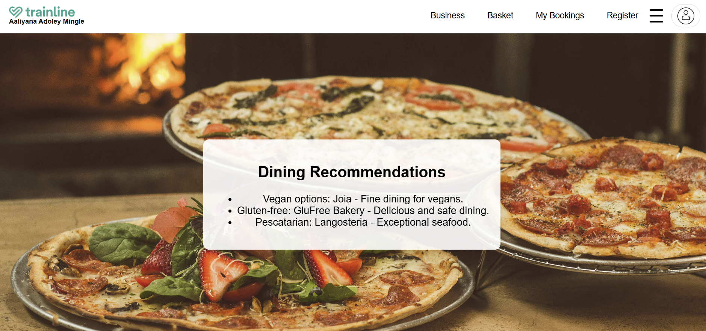

The second section will display vegan dining options for Ruby 🥗🌱, taking away the hassle of having to search for all of these restaurants beforehand. 🍴✅

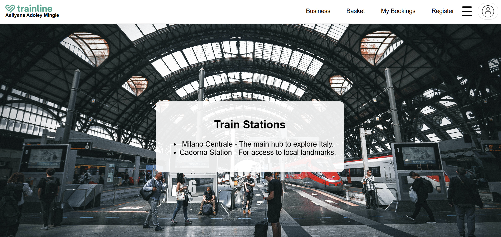

The third section will display train stations 🚉 in or near the area of Ruby's hotel 🏨. This is to ensure that Ruby can get around the city with the knowledge of transport facilities, making travelling around Milan much easier. 🚆🗺️

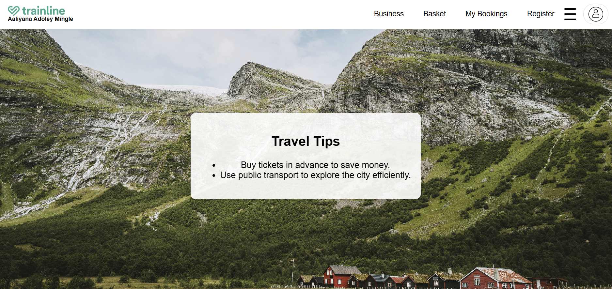

The fourth and last section will display some travel tips 💡 that Ruby may benefit from on her trip. This will include the best ways to save money 💷 and the recommended methods of transport. 🚖💼

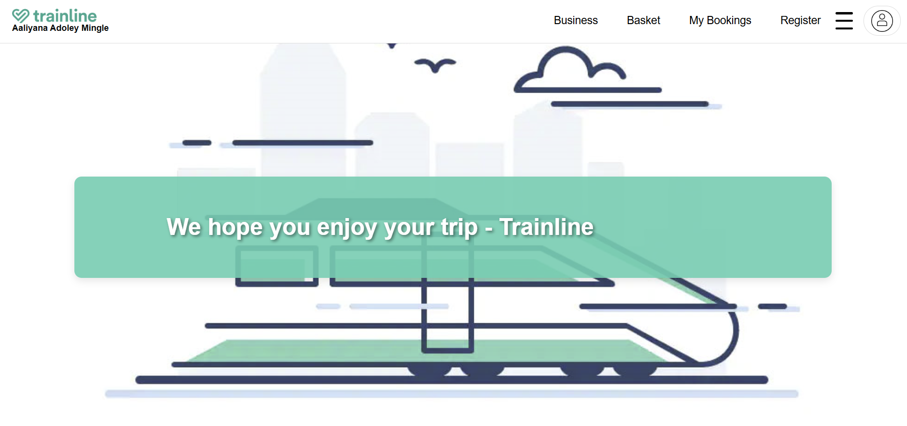

This is a concise and clear representation of how Tailored-line AI will be experienced by our users and how implementing a real-life example (Ruby) can really make this feature come to life. ✨

Tailored-line isn’t just an additional feature for trainline services. It’s a system that allows our customers to have a fulfilling, personalised, and safe travel experience, making every trip enjoyable and seamless. 🚆

Ultimately, people may not remember what a service did for them, but how the service made them feel and the lengths gone to create that impact (like it did for Ruby 😊).
#
# Tailored-line Video Demo! 🎥 (enjoy!)

<video controls src="Tailored-line Finale Demo!.mp4" title="Title"></video>

#
# How Hypothesis-Driven Development became the backbone of Tailored-line 🔍🧩

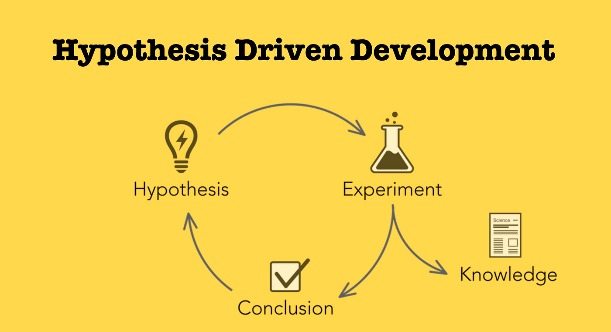

Software development often involves a degree of **uncertainty**. Developers strive to solve problems and build features that meet user needs, but it’s all too easy to fall into the trap of building for **assumptions** rather than facts. 🔍

I first encountered the concept of **Hypothesis-Driven Development (HDD)** while reading a blog post on Trainline’s Medium channel titled *"Lessons from Hypothesis-Driven Development."* The post discussed how **HDD** had become a core practice within Trainline's **Conversion Rate Optimisation (CRO)** team, which I found very interesting. 📚

After reading this, I began to reflect on my own development process and asked myself, *'How can I implement this solution within Tailored-line?'* It struck me that using **HDD** could provide a more **systematic** and **pragmatic** way to ensure that my feature was truly aligned with **user needs** at Trainline and delivered **meaningful value**. 💡

Following this, I started researching the impact of **tailored** and **personalised** features on **user engagement**. A study titled *"Validation of User Preferences and Effects of Personalized Gamification"* found that **software features reflecting user preferences significantly improve engagement and task performance**. Participants using **personalised settings** reported a more enjoyable experience and showed higher interaction rates. 📊

For Tailored-line, having a **questionnaire** to gather data about users' **travel preferences** and syncing itineraries with their **past travel history** can improve **engagement**. This approach enhances the **relevance** of travel recommendations and creates a more **seamless**, **personalised travel experience**. ✈️

**[Link to study](https://www.frontiersin.org/journals/computer-science/articles/10.3389/fcomp.2020.00029/full)** 📎

This research helped me foresee how **Tailored-line** could **positively impact Trainline’s customers**. By going the extra mile to ensure that each **itinerary recommendation** was **thoughtfully tailored** to individual preferences, the app wouldn’t just meet **user needs** but would create **moments of delight**. It became clear to me that **HDD** wasn’t just a method to improve **accuracy**, it was a way to embed **empathy** into development. ✨

The process of applying **HDD** to **Tailored-line** has been a **transformative experience**. It taught me to think more **critically** about the **purpose** behind every feature I develop. It also showed me that by taking a **hypothesis-driven approach**, we can build more **meaningful products** that **resonate with users on a deeper level**. 💻


### Now, Lets dive into the technical Components of Tailored-line and how the technologies I used assemble together to create this solution!
#

# 📝 Technologies I used for Tailored-line 📋

### These are the core technologies used to build and run the application itself:

| **Technologies**            | **Description**                          |
|-----------------------------|------------------------------------------|
| 🐍 **Python Flask**          | I used Flask to build the backend of my app, handling the user questionnaire and generating personalised itineraries based on the data collected. |
| 📦 **Redis**                 | Redis is used to store the answers from my questionnaire and manage session data, ensuring quick access to user responses and improving the app’s performance. |
| 📜 **JavaScript**            | I used JavaScript to make the frontend interactive and responsive, allowing users to smoothly complete the questionnaire and view their personalised itineraries. |
| 🧠 **Model**                 | I developed a model that processes user responses from the questionnaire to generate personalised itineraries tailored to Trainline user preferences. |
| 🌐 **HTML**                  | HTML structures the content of my app’s user interface, making it straightforward for users to navigate through the questionnaire and results. |
| 🎨 **CSS**                   | CSS styles the user interface, ensuring the app looks clean, modern, and visually appealing. |
| 🐳 **Docker Compose**        | I used Docker Compose to manage both the app and its dependencies, such as Redis, making it simple to deploy my application consistently across different environments. |
| 🛠️ **Docker**                | Docker allowed me to containerise my app, ensuring it runs smoothly and reliably on any system without compatibility issues. |

# 

# Key parts of my code and explanation 📡💻


In essence, **Tailored-line** is a **Flask** web application that uses a **Python** module **model** to simulate the behaviour of a **recommendation system/machine learning AI model**. It uses **data** from the **user questionnaire** and stores this in the **Redis database** so that it can be retrieved to generate the **personalised itinerary** for the user.

The **Python** module uses **pre-loaded CSV data files** of **user travel preferences** and **train schedules** to apply **logic**, creating the perfect **recommended travel options** for their journey. The **model** joins the **data** from the **CSV files** with the **data** stored in **Redis** from the **questionnaire** and generates a **personalised itinerary** for the user based on all this **data**.


 

### Lets take a look at the main code functions of Tailored-line
#
#### app.py code

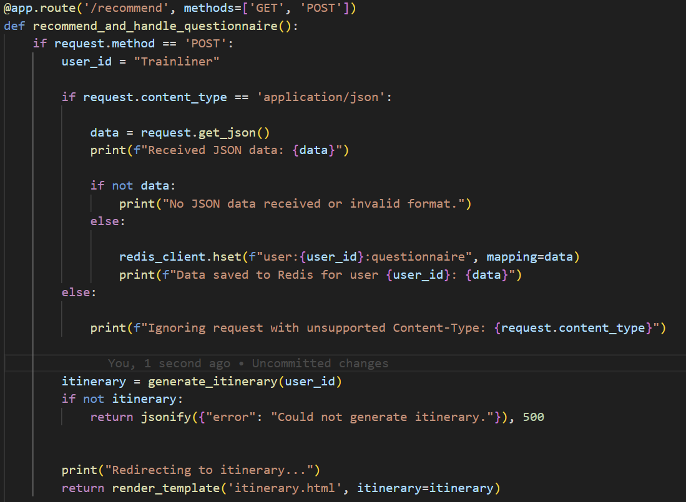

This is the **/recommend** route that handles the part of the application that takes in the **user inputs** as **data** in **Redis** and uses a function to generate the user's **itinerary** and load the **data** to do this.

The **/recommend** route handles both **GET** and **POST** requests. The **GET** request is specifically for saving **user questionnaire data** in **Redis** and the **POST** request is for displaying the **itinerary** within the function **generate_itinerary()**.
 

# 

#### model.py code

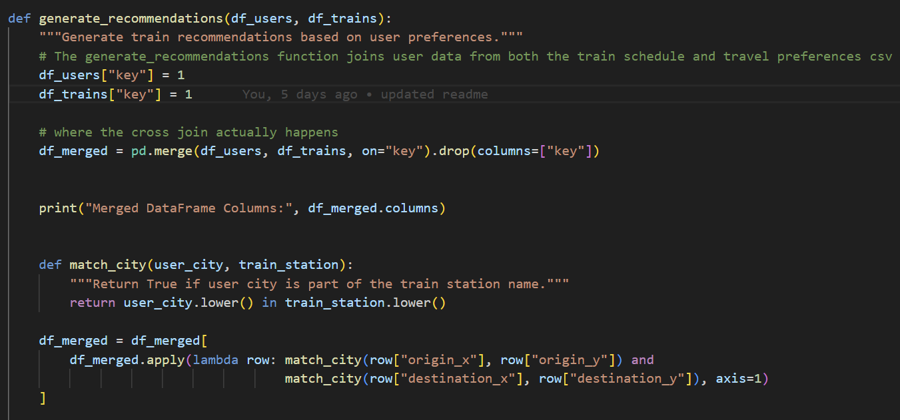

This is apart of my **model.py** code that shows the process of joining the **travel preferences** and **train schedule CSV file data** and applying **logic** to match key-value pairs like **is_student = student discount** in a **get_recommendations** function. This matches **travel preferences** with correct **values** to create perfect **tailored options**.

#

#### Javascript code 

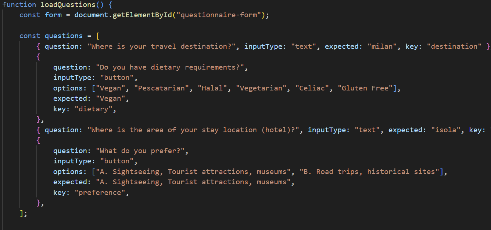

The function **LoadQuestions()** displays each question dynamically on the **user page** and checks for the right **input data** which is the **expected response**.

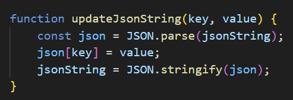

The **updateJsonString()** function stores the **user data inputs** from the **questionnaire** as a **JSON string**.

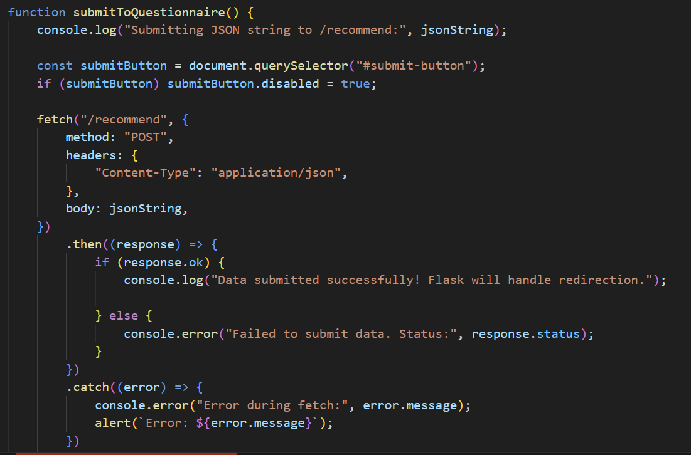

The **submitToQuestionnaire()** function communicates with the **Python backend** and sends the **user inputs** in the form of **JSON data** as a **POST request** to the **/recommend** route.
#

# What I learned from developing Tailored-line (Errors, Concepts, Engineering and more!)💡


### concepts:

 Developing **Tailored-line** challenged me to think critically about making certain **decisions** such as what **database** to use to store **user inputs** and how to handle **user data** to make **predictions** for the **itinerary**.

I thought about the **functionality** of my application and knew I would need a **database** that could quickly retrieve **data** in a **cached state**.

In regards to the **Python module (model)** that I used to handle the **data**, I initially settled on researching different types of **machine learning models** to fit within this feature. However, I realised that understanding the **principles of machine learning** and how to **train a machine learning model** to understand and process **data** would require extensive **time and research**.

The **Python module (model)** handles the **data** using **recommendation logic** to create the perfect **travel options** with **key-value pairs**. It **cross joins** data from **preloaded CSV files** along with **JSON data** stored in **Redis** with the **user inputs** from the **travel questionnaire**.

#

### Errors:

 In my application, one of the purposes of my **JavaScript** code was to store **user inputs** as a **JSON string** so that it could communicate a **POST request** to the **backend** to send the **user input data** to generate the **itinerary**.

However, there was an **error** in my **JavaScript** code where it was sending **multiple POST requests** to the **backend Python code**. This caused my **Python code** to have trouble processing all these **requests** and to understand which **request** was in **JSON form**.

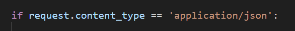

To solve this problem, I had to add a **HTTP header** within my **Python code** to ensure that the **POST requests** were in **JSON form** before processing it for the **itinerary**. (The HTTP header is what makes sure the data is in JSON form so that the backend can process the request.)

#
# Improvements I could have made with Tailored-line ✅📈

### Implementing realtime machine learning model:

 One of the key **improvements** I could implement with **Tailored-line** is using an actual **machine learning model** to present a **realtime experience** for the application.

While the **Python module (model)** simulates an **AI experience**, having a real **trained model** to perform the **function** of the application improves overall **user experience** and **organisation** of the **code**.


### Improving adaptability of code:

 When thinking about my **application** in a **production** sense, I think I could have improved my **code** by developing it to **receive** all different types of **user inputs**.

For example, the current **code** in my **application** is specifically developed to represent our **Trainliner 'Ruby'**, with **pre-configured travel data** and **inputs** from her **questionnaire**. However, this **application** will need to be open to **receiving** all different types of **user inputs** from different **user destinations**, **dietary requirements**, to **travel preferences**.

This is what will make **Tailored-line** **inclusive** to all **users**, by adapting the **code** to be **receptive** to all **user inputs**.

### Thinking about scalability:

 Although I thought carefully about each and every **technology** I used in my **application**, thinking about **optimisation** and **scalability** would have improved the overall **system design** and **architecture**.

For example, understanding whether I would need to **vertically** or **horizontally scale** my **application**. **Tailored-line** is a feature intended to be used by **billions of Trainline users** simultaneously, meaning that **horizontal scaling** would be something I would need to think about (adding more **servers** to my **machine** to handle **user traffic**).

Critically thinking about how much **data traffic** would be coming in and out of the **application** is crucial as well, and therefore applying concepts such as **database replication** would need to be considered additionally.


#
# Local App Set up 🖥️

### Build and run the containers 🐳
```
 docker-compose --build
```
This command builds the images for application as defined in the docker-compose.yml file. It reads the Dockerfile for each service, such as my Flask app and Redis, and creates the necessary images to run the application.
```                        
docker-compose up
```
This command builds the images and starts the containers in one step. In this app, if I’ve made changes to the Dockerfile or any dependencies, this command ensures the images are rebuilt before the app starts running.

#
## How to Access The Application 🚀
### Open your browser and navigate to this web link after running the docker containers: http://127.0.0.1:5000/

#### You will be greeted with a beautiful and sleek Welcome page Ready for you to experience Tailored-line 😊

**Note:** I have specifically developed the code for the Travel Questionnaire to only accept specified inputs as a test run.

> ## Here are the answers for each question
>
> ### 1. Where is your travel destination = 'milan'
>
> ### 2. Do you have dietry requirements = 'vegan' (select button)
>
> ### 3. Where is the area of your stay location (hotel)? = 'isola'
>
> ### 4. What do you prefer? = A. Sight seeing, Tourist attractions, museums (select button)

### Navigate to http://127.0.0.1:5000/itinerary after finishing the Travel Questionnaire to view the web page with the travel itinerary displayed!
#
# Thank you! 🎊
